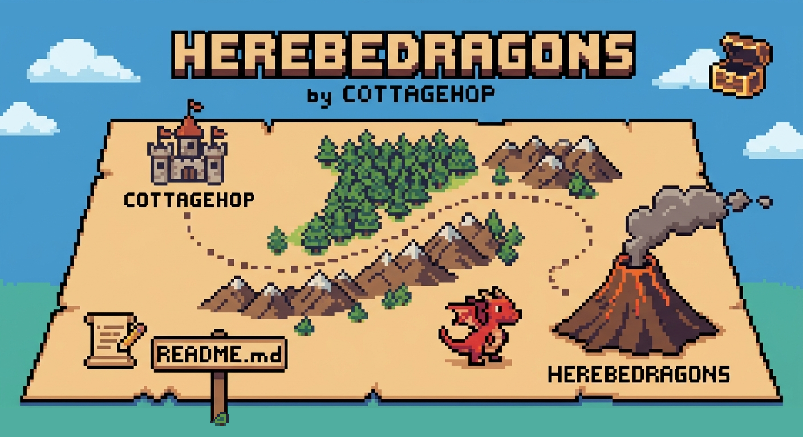

A 3D vector map for the web. Stylized buildings, drifting volumetric clouds, raymarched lighting. Reads PMTiles vector archives, renders with three.js. Drops into a single `<div>` with one function call.

**[Live demo →](https://cottagehop.github.io/HereBeDragons/)** &nbsp;·&nbsp; [with Studio](https://cottagehop.github.io/HereBeDragons/?studio=1) &nbsp;·&nbsp; [real-estate investor view](https://cottagehop.github.io/HereBeDragons/?theme=professional&investor=1) &nbsp;·&nbsp; [with demo polygons](https://cottagehop.github.io/HereBeDragons/?polygons=1)

```
npm install github:cottagehop/HereBeDragons three
```

Installed straight from GitHub: npm builds the library on install (via the `prepare` script), so you get `dist/` with bundled JS and type declarations. The package name stays `@cottagehop/here-be-dragons`, so imports are unchanged. Pin a specific release with `github:cottagehop/HereBeDragons#v0.1.0`.

`three` is a peer dependency install it explicitly so your bundler dedupes it with anything else that uses three.

---

## 30-second quickstart

```html
<!doctype html>
<html>
  <body>
    <div id="app" style="position: fixed; inset: 0;"></div>
    <script type="module">
      import { createHereBeDragons } from '@cottagehop/here-be-dragons';

      const map = await createHereBeDragons(document.getElementById('app'), {
        center: { lat: 40.7065, lon: -74.009 },
        zoom: 15,
        pmtiles_url: 'https://your-tiles.example.com/tiles.pmtiles'
      });
    </script>
  </body>
</html>
```

That's it. You get a 3D map with stylized buildings, roads, water, and labels. The map sizes to fill its container give that container a width and height (the `position: fixed; inset: 0;` snippet above is the simplest "fill the page" recipe).

---

## Use it without writing code (Studio → JSON → embed)

The fastest workflow:

1. Open the demo with `?studio=1` (or call `createMapStudio(map, ...)` in your code).
2. Pick a theme, drag the camera sliders, tweak colors, toggle layers everything is live.
3. Click **Export JSON**. The browser downloads `here-be-dragons.config.json`. (Click **Import JSON** to load a saved config back into the panel and keep iterating.)
4. On your real site, fetch that JSON and pass it straight to `createHereBeDragons`:

```js
import { createHereBeDragons } from '@cottagehop/here-be-dragons';

const config = await fetch('/map-config.json').then((r) => r.json());
await createHereBeDragons(document.getElementById('app'), config);
```

The exported JSON is a literal `HereBeDragonsOptions` value `theme`, `customColors`, `clouds`, `compass`, layer toggles, camera position, all of it. `createHereBeDragons` applies the declarative fields automatically. **No imperative `applyTheme` / `setCloudsOpacity` / etc. calls are needed.**

---

## Options reference (`HereBeDragonsOptions`)

| Field | Type | Default | Description |
|---|---|---|---|
| `center` | `{ lat, lon }` | required | Initial geographic center. |
| `zoom` | `number` | required | Initial zoom (sane range 4–20). |
| `pmtiles_url` | `string` | required | PMTiles archive URL (or local path). |
| `tilt` | `number` | `55` | Camera pitch in degrees (0 = top-down). |
| `bearing` | `number` | `0` | Camera rotation from north, +CW. |
| `theme` | `ThemeName \| string` | `undefined` | Apply a named theme on load. Autocompletes the built-ins. |
| `customColors` | `Partial<ThemeColors>` | `undefined` | Per-color overrides on top of the theme. |
| `clouds` | `boolean \| { enabled?, opacity? }` | `false` | Volumetric cloud pass on/off + opacity. Off by default (the raymarch is the heaviest per-frame GPU cost). |
| `compass` | `boolean` | `true` | Show the compass overlay. Click to reset bearing. |
| `surfacePainterly` | `number` (0..1) | theme | Watercolor wash on flat surfaces (ground, water, landuse, beach). Overrides the theme. |
| `paperGrain` | `number` (0..1) | theme | Screen-space paper grain folded into the final pass. |
| `roadTexture` | `number` (0..1) | theme | Procedural road surfacing: cobblestone setts on roads, mottled earth on paths. |
| `spores` | `boolean` | theme | Drifting pollen motes in the air. |
| `buildingStyle` | `ThemeBuildingStyle` | theme | Painterly building treatment: plaster walls, glowing windows, tiled roofs, per-building variety. |
| `cloudPreset` | `CloudPreset` | theme | Cloud look: coverage, density, altitude band, noise scale, wind speed, cloud + shadow colors. Separate from `clouds` on/off. |
| `lightPreset` | `LightPreset` | theme | Lighting look: sun color/intensity, fill, ambient, hemisphere sky/ground/intensity. |
| `windStrength` | `number` | `1` | Wind-sway multiplier for the grass + tree billboards (0 = still). |
| `signsDensity` | `number` (0..1) | `0.5` | Shop-sign banner density. Needs the `signs` layer enabled. |
| `signsMinZoom` | `number` | `15` | Camera zoom at/above which shop-sign banners appear. |
| `outline` | `OutlineConfig` | theme | Illustrated outline/ink look + saturation: edge `strength`/`darkness`, comic `halftone`/`hatching`, `saturation`. |
| `layers` | `Partial<Record<LayerName, boolean>>` | most on | Per-layer enable/disable. See [Layers](#layers). |
| `tags` | `TagsConfig` | `{}` | Tag overlay configuration (clustering, default styles). |
| `buildings` | `BuildingPopupConfig` | `{}` | Building picker + popup settings. |
| `bounds` | `BoundingBox` | `undefined` | Geographic box that clamps camera panning. Use `COMMON_BOUNDS` for presets. |
| `tiltRange` | `{ min, max }` | `0–75°` | Clamp the allowed tilt range. Initial value still comes from `tilt`. |
| `bearingRange` | `{ min, max }` | full 360° | Clamp the allowed bearing range. Initial value still comes from `bearing`. |
| `zoomRange` | `{ min, max }` | `~4–22` | Clamp the allowed zoom range. Initial value still comes from `zoom`. |
| `useUserLocation` | `boolean` | `false` | Request `navigator.geolocation` and fly there on resolve. |
| `quality` | `'low' \| 'high' \| 'auto'` | `'auto'` | Render-quality tier. `'auto'` detects the GPU and downgrades integrated graphics to `'low'`. See [Performance](#performance-tuning). |
| `pixelRatio` | `number` | quality-capped `devicePixelRatio` | Override render resolution. Always wins over the `quality` tier's cap. |
| `background` | `string` | theme sky | Canvas background color. |
| `performance` | `{ workerPoolSize?, visibleRadius?, tileWindowRadius?, tileWindowRadiusFar?, maxTileApplyMsPerFrame? }` | auto | Tile-pipeline tuning. See [Performance](#performance-tuning). |

### Layers

`LayerName` values: `'buildings'`, `'roads'`, `'rails'`, `'water'`, `'waterways'`, `'landuse'`, `'labels'`, `'trees'`, `'grass'`, `'waves'`, `'signs'`, `'cars'`. The base layers default to enabled; `'trees'`, `'grass'`, `'waves'`, `'signs'`, and `'cars'` are opt-in.

```js
layers: {
  buildings: true,
  roads: true,
  rails: false,        // hide subway lines
  cars: true,          // opt into animated traffic
  trees: true,         // billboard trees (sway in the wind)
  grass: true,         // wind-blown grass tufts over parks
  waves: true,         // animated foam along the shoreline
  signs: true,         // sparse Japanese shop-sign banners
}
```

### Themes

Built-in `ThemeName` values: `'ghibli'`, `'professional'`, `'cottagecore'`, `'cottagecoredark'`, `'modern'`, `'greyscale'`, `'dark'`, `'cyberpunk'`, `'eighties'`, `'seventies'`, `'oldworld'`, `'middleearth'`, `'concretejungle'`, `'comic'`.

Two are worth calling out:

- **`ghibli`** — the showcase stylized look (painterly walls, tiled roofs, kawara texture, wind-blown grass, drifting pollen, lit shopfronts). Toggle every effect individually via the runtime setters above.
- **`professional`** — a clean, neutral preset for client-facing **real-estate maps**: soft grey buildings, calm blue water, restrained outlines, a strong professional-blue building/floor highlight tuned for picking out listings and comps. Every Ghibli FX is deliberately off, so the map reads as a polished business product.

```js
import { createHereBeDragons, THEMES } from '@cottagehop/here-be-dragons';

// As an option:
await createHereBeDragons(el, {
  center, zoom, pmtiles_url,
  theme: 'concretejungle',
  customColors: { building: '#222', water: '#0a2030' }
});

// At runtime:
map.applyTheme('comic');
map.setCustomColors({ road: '#000' });

// Register your own theme:
THEMES.myCustom = { land: '#fff', building: '#333', park: '#7cc', water: '#08f', road: '#222' };
map.applyTheme('myCustom');
```

A `ThemeColors` object has five required keys (`land`, `building`, `park`, `water`, `road`) plus optional `beach`, `sky`, `highlight`, `outline`, `saturation`.

---

## Instance API (`HereBeDragons`)

### View

```ts
map.setView(lat, lon, zoom?)
map.setBearing(deg)
map.setTilt(deg)
map.getView()                   // { lat, lon, zoom, tilt, bearing }
await map.flyTo({ lat, lon, zoom?, tilt?, bearing?, durationMs? })
await map.resetView(durationMs?)

// Clamp how far the user can drag past the initial value.
// Pass null to release a clamp.
map.setTiltRange({ min: 20, max: 50 })
map.setBearingRange({ min: -45, max: 45 })
map.setZoomRange({ min: 12, max: 18 })
```

### Layers + appearance

```ts
map.setLayerEnabled('roads', false)
map.getLayerEnabled('cars')
map.applyTheme('concretejungle')
map.setCustomColors({ water: '#1a3a4a' })
map.getCurrentTheme()
map.getCustomColors()
map.setBuildingsFlat(true)      // collapse extrusions to footprints
map.setCloudsEnabled(false)
map.setCloudsOpacity(0.6)
```

### Ghibli atmosphere + painterly FX

Every stylized feature is runtime-configurable (and round-trips through the Studio export). Each is seeded by the active theme and individually overridable.

```ts
// Painterly surface FX (all 0..1)
map.setSurfacePainterly(0.9)    // watercolor wash on ground/water/landuse
map.setPaperGrain(0.8)          // screen-space paper grain
map.setRoadTexture(1)           // cobblestone roads + dirt paths
map.setSporesEnabled(true)      // drifting pollen motes

// Painterly buildings (null clears it back to flat toon buildings)
map.setBuildingStyle({ strength: 1, roof: '#b5573c', window: '#ffdc8c', floorHeight: 3.6 })
map.getBuildingStyle()          // resolved { strength, roof, window, floorHeight }

// Cloud look (separate from the on/off + opacity above)
map.setCloudPreset({ coverage: 0.42, densityScale: 4.6, altitudeMin: 650, altitudeMax: 1600,
                     cloudColor: '#fff6e6', shadowColor: '#b9c6dc' })

// Lighting rig
map.setLightPreset({ sun: '#fff0cf', sunIntensity: 1.08, hemiSky: '#bfe2f6', hemiIntensity: 0.34 })

// Wind + signs
map.setWindStrength(1.5)        // grass + tree sway (0 = still)
map.setSignsDensity(0.5)        // shop-sign banner density 0..1
map.setSignsMinZoom(15)         // zoom at/above which banners appear

// Outline / ink look + saturation (only the provided fields change)
map.setOutline({ strength: 0.85, darkness: 0.72, saturation: 1.75 })
map.getOutline()                // resolved { strength, darkness, halftone, hatching, saturation, ... }
```

`setBuildingStyle`/`setCloudPreset`/`setLightPreset` accept `null` to reset to the neutral default. Each setter has a matching getter that reads back the resolved live values (from the shader uniforms / lights), so the Studio can stay in sync.

### Tags (interactive markers)

```ts
const tag = map.addTag({
  id: 'home',
  lat: 40.7065, lon: -74.009,
  icon: '🏠',
  text: '$1.2M',
  badge: '3 BR',
  color: '#10b981',
  modal: { title: 'Trinity Church Condo', body: '<p>South-facing 3 BR…</p>' },
  onClick: (handle, evt) => { console.log('clicked', handle.id); }
});

tag.setText('$1.4M');
tag.setColor('#f59e0b');
tag.open();         // open the modal programmatically
tag.close();
tag.remove();

map.removeTag('home');
map.clearTags();
```

Tags within `mergeDistancePx` of each other automatically collapse into a count cluster; clicking the cluster zooms toward its centroid.

#### Real-estate listing presets

For client-facing real-estate maps, `REAL_ESTATE_TAG_PRESETS` is an opinionated set of color + icon + badge defaults for the common listing states (`forSale`, `pending`, `sold`, `newListing`, `openHouse`, `comp`, `subject`). Spread one into your `addTag` call to get a polished, consistent marker with one line:

```js
import { createHereBeDragons, REAL_ESTATE_TAG_PRESETS as RE } from '@cottagehop/here-be-dragons';

map.addTag({ id: 'l1', lat, lon, text: '$1.2M', ...RE.forSale });
map.addTag({ id: 'l2', lat, lon, text: '$980K',  ...RE.sold });
map.addTag({ id: 'subject', lat: subLat, lon: subLon, text: 'Subject', ...RE.subject });
```

The colors are tuned to read cleanly over the `professional` theme but stay legible on every built-in palette. The preset map is frozen, so it's safe to share across instances.

### Polygons (custom filled regions)

```ts
const poly = map.addPolygon({
  id: 'demo-zone',
  color: '#22c55e',
  opacity: 0.4,
  points: [
    { lat: 40.7070, lon: -74.0120 },
    { lat: 40.7080, lon: -74.0080 },
    { lat: 40.7060, lon: -74.0060 }
  ]
});
map.removePolygon('demo-zone');
```

#### Comp-radius helper

`makeRadiusPolygon(lat, lon, radiusMeters, segments?)` returns an array of `PolygonPoint` approximating a geodesic circle (spherical destination-point formula, sub-metre accurate at city scale). Drop it straight into `addPolygon` to visualise a comparables radius, walkability buffer, service area, or flood-plain rim:

```ts
import { makeRadiusPolygon } from '@cottagehop/here-be-dragons';

map.addPolygon({
  id: 'comp-radius',
  color: '#3b82f6',
  opacity: 0.20,
  points: makeRadiusPolygon(subject.lat, subject.lon, 800)  // 800 m around the subject
});
```

### Buildings

```ts
map.onBuildingClick((info) => {
  console.log(info.id, info.height, info.properties);
});
const info = map.selectBuilding('osm:way/12345', /*floor*/ 12);
map.clearBuildingSelection();
map.setBuildingPopup({ popupEnabled: false });   // disable the auto popup
map.setBuildingHighlightColors('#ffe600', '#7ec8ff');
const all = map.getLoadedBuildings();            // BuildingInfo[]
```

The canvas cursor swaps from `grab` to `pointer` the moment a user hovers a building, signalling clickability for the property-shopping UX. The hovered building itself also gets a subtle warm brighten, so users can see exactly which one is under the cursor. The hover raycast is RAF-throttled internally so a fast-moving pointer can't burn dozens of raycasts per second, and the highlight only triggers a redraw when the hovered building actually changes — a pointer drifting across a single building costs nothing.

### Scale bar

A small `100 ft / 50 m` bar pinned bottom-right of the map. On by default, click to toggle units, defaults to imperial. Snaps to round-number steps so the label always reads like a number on a printed plan.

```ts
const map = await createHereBeDragons({
  container: '#app',
  source: { ... },
  scaleBar: { units: 'metric', targetWidthPx: 100 },  // or false to suppress
});
map.setScaleBarUnits('imperial');                     // runtime swap
const mpp = map.getMetersPerPixel();                  // build your own overlays
```

### Snapshot / screenshot export

Synchronous capture of the current view as a data URL. The render and canvas read happen in the same JS tick — no extra render-target plumbing — so it works with the default `preserveDrawingBuffer: false` (which is much faster for the normal render loop). DOM overlays (compass, scale-bar, tag popups) are not in the canvas and so not in the snapshot.

```ts
// Quick PNG at the current resolution
const dataUrl = map.snapshot();

// HiDPI for print / property reports
const hiRes = map.snapshot({ pixelRatio: 2 });

// JPEG with smaller file size
const jpeg = map.snapshot({ mimeType: 'image/jpeg', quality: 0.85 });

// Trigger a download
const link = document.createElement('a');
link.href = map.snapshot({ pixelRatio: 2 });
link.download = 'property.png';
link.click();
```

### Events

```ts
const off = map.on('ready', () => console.log('first tile request queued'));
map.on('tileload', (e) => console.log('tile', e.z, e.x, e.y));
map.on('tileerror', (e) => console.warn(e.error));
map.on('viewchange', (v) => console.log(v.lat, v.lon, v.zoom));
off();          // unsubscribe
```

### Lifecycle

```ts
map.resize();          // call from your window.resize handler
map.destroy();         // releases GPU resources + DOM

// Perf introspection — wire these into your own HUD / telemetry without
// touching internals. Sampled on render frames only (hidden-tab frames don't
// pollute the EMA); reset on every visibility-resume.
map.getFrameMs();      // smoothed RAF-to-RAF, e.g. 16.7
map.getFps();          // derived from getFrameMs(), e.g. 60
map.getQualityTier();  // 'low' | 'high'
map.getPixelRatio();   // currently-applied DPR (drops during dynamic-res motion)
```

The renderer survives WebGL context loss out of the box: the canvas opts into restoration (`preventDefault` on `webglcontextlost`) and `three`'s `WebGLRenderer` re-uploads its textures, programs, and buffers on the matching `webglcontextrestored` event. The map automatically forces a redraw once the context is back, so a long tab-background or a GPU driver reset doesn't kill the map.

The render loop also **pauses entirely when the tab is hidden** (`document.visibilitychange`), so a map embedded in a backgrounded tab costs zero CPU + GPU until the user returns to it. The first resumed frame uses a fresh delta so damping/clouds don't snap.

---

## The Studio (`createMapStudio`)

The Studio is an in-browser control panel for designing a map without writing code. It edits a live `HereBeDragons` and exports its state as a JSON config.

```js
import { createHereBeDragons, createMapStudio } from '@cottagehop/here-be-dragons';

const initialConfig = {
  center: { lat: 40.7065, lon: -74.009 },
  zoom: 15,
  pmtiles_url: '/tiles.pmtiles'
};

const map = await createHereBeDragons(document.getElementById('app'), initialConfig);

createMapStudio(map, {
  initialConfig,                  // round-trips pmtiles_url / pixelRatio / etc.
  onExport: (cfg) => {
    // Optional: intercept the export. Return `false` to suppress the default
    // file download (e.g. POST the config to your backend instead).
    console.log('exported', cfg);
  }
});
```

### What the Studio panel exposes

- **Theme picker** visual grid of every registered theme (filterable via the `themes: [...]` option)
- **Custom colors** `land`, `building`, `park`, `water`, `road`, `beach`, `sky` color pickers (applied on top of the active theme)
- **Selection highlight** popup toggle + building/floor color pickers
- **Camera** tilt, bearing, zoom sliders, kept in sync as the user drags on the canvas. Each slider has a `↔` toggle that opens a **Min / Max** sub-editor: turn it on to limit how far the camera can move on that axis. The exported JSON includes `tiltRange` / `bearingRange` / `zoomRange` only for axes whose toggle is active.
- **Layers** per-layer checkboxes + a "flatten buildings" toggle
- **Clouds** enable/disable + opacity slider
- **Cloud Look** coverage, density, altitude band, noise scale, wind speed sliders + cloud/shadow color pickers
- **Lighting** sun color + intensity, fill, ambient, hemisphere sky/ground colors + intensity
- **Painterly FX** surface wash, paper grain, road texture sliders, spores toggle, and a global wind slider
- **Buildings (painterly)** strength + floor-height sliders, roof + window color pickers
- **Signs** banner density + min-zoom sliders
- **Outline / Ink** edge strength + darkness, halftone, hatching, and saturation sliders
- **Compass** show/hide overlay toggle
- **Import JSON** button loads a config file (e.g. a previously exported one) and applies every editable setting to the live map, syncing all panel controls to match
- **Export JSON** button downloads `here-be-dragons.config.json`

### `StudioOptions`

| Field | Type | Default | Description |
|---|---|---|---|
| `container` | `HTMLElement` | `document.body` | Mount point. |
| `open` | `boolean` | `true` | Initial expanded state. |
| `injectDefaultStyles` | `boolean` | `true` | Inject the panel's CSS into `<head>`. |
| `themes` | `string[]` | all registered | Subset of theme names to show. `[]` hides the section. |
| `compass` | `boolean` | inherit | Force the compass overlay on / off at construction. |
| `initialConfig` | `Partial<HereBeDragonsOptions>` | `{}` | Source of non-queryable fields (`pmtiles_url`, `pixelRatio`, `background`). |
| `onExport` | `(cfg) => boolean \| void` | `undefined` | Intercept the export. Return `false` to suppress the default download. |
| `onImport` | `(cfg) => boolean \| void` | `undefined` | Intercept the parsed config before it's applied. Return `false` to apply it yourself via `setConfig`. |

### Studio handle

```ts
const studio = createMapStudio(map, { initialConfig });

studio.getConfig();    // read current config without exporting
studio.export();       // trigger the export flow programmatically
studio.setConfig(cfg); // apply a config to the live map + sync the panel controls
studio.setOpen(false); // collapse the panel
studio.destroy();      // remove DOM + listeners
```

### Adding a control that isn't there

The Studio's section list is currently hard-coded. To add a control not in the panel today, mount your own DOM next to the studio panel and call the map's API directly:

```js
const studio = createMapStudio(map, { initialConfig });

// Mount custom controls in your own panel.
const myPanel = document.createElement('div');
myPanel.innerHTML = `
  <label>Time of day
    <input id="tod" type="range" min="0" max="24" step="0.1" value="12" />
  </label>
`;
document.body.appendChild(myPanel);

document.getElementById('tod').addEventListener('input', (e) => {
  const hour = Number(e.target.value);
  // example: rotate the sun by tying it to bearing for a quick visual sweep
  map.setBearing((hour / 24) * 360 - 180);
});
```

If you need a control to round-trip through the exported JSON, write it into the JSON yourself after `studio.export()` returned its config or open an issue describing the use case and we'll add a first-class API.

---

## Config round-trip (the recommended workflow)

```js
// 1. Design the map in Studio. Click "Export JSON". You get something like:
{
  "center": { "lat": 40.7065, "lon": -74.009 },
  "zoom": 15.4,
  "tilt": 55,
  "bearing": 0,
  "pmtiles_url": "/tiles.pmtiles",
  "theme": "concretejungle",
  "customColors": { "water": "#0a2030" },
  "clouds": { "enabled": true, "opacity": 0.7 },
  "compass": true,
  "layers": { "water": true, "buildings": true, "rails": false, "cars": false }
}

// 2. Save that file alongside your site assets (e.g. /public/map-config.json).

// 3. Load it in a single fetch + createHereBeDragons call:
const cfg = await fetch('/map-config.json').then((r) => r.json());
const map = await createHereBeDragons(document.getElementById('app'), cfg);
```

The map renders identically to what you designed in Studio. No imperative setup. No `applyTheme` / `setCloudsOpacity` / `setLayerEnabled` calls.

---

## Performance tuning

### How tile decoding works

Every tile in the visible window goes through this pipeline:

1. **Fetch** PMTiles range-request returns the raw MVT bytes. Async, non-blocking.
2. **Worker decode** handed to one of the worker threads (round-robin). Inside the worker, decoding runs in **two phases**:
   - **Phase 1 (base)** water, waterways, landuse, roads, rails, labels. Cheap to extract (~5–15 ms). Posted back immediately.
   - **Phase 2 (buildings)** the heavy one. The union-find that groups multi-part buildings is O(n²) over features in the tile, so a dense Manhattan-scale tile spends 50–200 ms here. Posted back when it finishes.
3. **Scene update** the main thread builds three.js meshes from each phase's geometry and adds them to the tile's group as soon as they arrive. The base map appears within milliseconds; buildings fill in afterward.

The two-phase split means **users see streets, water, and labels almost instantly** even while building decoding is still grinding. Disabling the `buildings` layer entirely skips phase 2 in the worker.

### Default tile load (at z=15)

The dispatcher is **frustum-aware**: each frame, the camera's four screen corners are raycast onto the ground plane to compute a tile-coordinate bbox of what's actually visible. Only tiles inside that bbox (plus a 1-tile margin) get loaded. With a 55° camera tilt, the visible region is a trapezoid mostly in front of the camera target typically 20–40 tiles at z=15, not the symmetric square the older Chebyshev approach loaded.

| Knob | Default | Result |
|---|---|---|
| `visibleRadius` | `3` | tier-0 priority radius around camera target |
| `tileWindowRadius` / `tileWindowRadiusFar` | `6` / `6` | safety cap on tile count when the camera looks near horizon (radius from target) |
| `workerPoolSize` | `min(4, hardwareConcurrency − 1)` | 3–4 worker threads |
| `maxTileApplyMsPerFrame` | `3` | per-frame ms budget for applying decoded tiles to the scene |
| `dispatchInterval` | `4` | heavy visibility/dispatch pass runs every N-th RAF tick (≈ 15 Hz at 60 FPS) |

Two-tier within the bbox:

- **Tier 0** within `visibleRadius` of the camera target. These dispatch first.
- **Tier 1** the rest of the frustum bbox (with margin). Dispatched after tier 0.

The candidate set is the camera frustum's actual ground footprint a convex **trapezoid**, not its bounding box. Every candidate tile is point-in-quad tested against that trapezoid (inflated by a 1-tile margin for smooth panning), so the big off-screen triangles at the near-edge corners of the bounding rectangle never get loaded.

Within each tier the order is a **concentric ring expansion from the camera target** (the screen center) closest squared-Euclidean distance first. Same-ring tiles tiebreak right-before-left so the fan stays visually symmetric.

Tile builds are bounded by a per-frame ms budget (`maxTileApplyMsPerFrame`) so a burst of worker completions can't block pointer/wheel input. The drain loop applies tiles closest to the camera first and yields once the budget is spent (always applying at least one tile per frame so the queue can drain even when a single build exceeds the budget). The heavy "what's visible now?" recompute runs only every `dispatchInterval` frames (default 4 → ~15 Hz at 60 FPS), also borrowed from PolyMap tile fetches are network-bound and decodes take 50–200 ms in workers, so polling visibility at 60 Hz was wasted main-thread work that competed with input and rendering. **You can pan and zoom during the initial load.** As you pan, the frustum bbox shifts and new tiles are dispatched at the new viewport; tiles outside the new bbox stay in the LRU cache for a short grace period.

### Tuning options

Pass a `performance` object to `createHereBeDragons`:

```js
await createHereBeDragons(el, {
  center, zoom, pmtiles_url,
  performance: {
    visibleRadius: 3,             // smaller "in viewport" set (49 tiles)
    tileWindowRadius: 6,          // shrink the pre-loaded buffer (~169 tiles)
    tileWindowRadiusFar: 8,
    workerPoolSize: 2,
    maxTileApplyMsPerFrame: 3     // tighter budget = smoother input under load
  }
});
```

Concrete trade-offs (frustum-aware loading; "tiles loaded" is the typical count after the frustum-bbox intersection with the radius cap):

| Profile | `visible` / `window` / `far` | Typical tiles loaded | Behavior |
|---|---|---|---|
| Default | 3 / 6 / 6 | ~25–40 (frustum-clipped) | Tight viewport-only, snappy load, pop-in only on very fast pans |
| Buffered | 4 / 8 / 10 | ~60–120 | Wider buffer, smoother fast-pan, slower first paint |
| Mobile | 2 / 4 / 4 | ~12–25 | Strictest, fastest load, visible pop-in |
| Pre-cached | 5 / 12 / 14 | ~200–400 | Big buffer, almost no pop-in, slower initial load |

Other levers built into the library:

- **Disable layers you don't need** `layers: { rails: false, cars: false, labels: false }`. Disabled layers are now skipped at the worker level entirely (no decode cost), not just hidden post-render.
- **Disable buildings if you only need the base map** the heaviest single extractor. `layers: { buildings: false }`. Frees ~70% of worker CPU per tile.
- **Disable clouds** `clouds: false`. Saves a full-screen raymarch pass every frame.

### Quality tiers

On lower-end GPUs / integrated graphics / mobile, the per-frame rendering cost can dominate independent of tile loading. The map runs a multi-pass pipeline (color, normal-for-outlines, outline, clouds, FXAA) at the canvas's native pixel ratio, so a 2× Retina display means ~4× the pixel work of a 1× display.

The `quality` option handles this for you:

```js
await createHereBeDragons(el, {
  center, zoom, pmtiles_url,
  quality: 'auto'   // the default detects the GPU and downgrades if needed
});
```

- **`'auto'`** (default) probes the GPU via `WEBGL_debug_renderer_info`. Intel integrated graphics (e.g. the Iris Plus in a 2019 MacBook Pro 13"), software rasterizers, and "no WebGL" all resolve to `'low'`; discrete GPUs, Apple Silicon, and privacy-redacted renderers stay `'high'`. It only ever *downgrades* on a confident match, so a capable machine is never blurred by mistake.
- **`'low'`** `pixelRatio` capped to 1 (no Retina super-sampling the single biggest fill-rate win, ~4× fewer pixels), MSAA off (FXAA alone handles AA), and a tighter tile-load window (`visibleRadius` 2, `tileWindowRadius`/`Far` 4, `dispatchInterval` 6).
- **`'high'`** full desktop quality: `pixelRatio` up to 2, 4× MSAA, default tile window.

An explicit `pixelRatio` or any `performance.*` field always overrides what the tier would have set so you can force `quality: 'low'` but keep `pixelRatio: 1.5`, or stay on `'high'` but tighten the tile window.

If you want to go further than `'low'`, the individual knobs are still there:

```js
await createHereBeDragons(el, {
  center, zoom, pmtiles_url,
  quality: 'low',
  clouds: false,                  // skip the cloud raymarch pass
  layers: {
    rails: false,                 // skip ribbon + crosstie geometry
    labels: false,                // skip the sprite-text overlay
  },
  performance: { maxTileApplyMsPerFrame: 3, workerPoolSize: 2 }
});
```

## Hosting your tiles

`pmtiles_url` accepts any URL the browser can fetch absolute, relative, or `https://`. The library uses range requests, so your server must support `Range:` headers (S3, CloudFront, GCS, plain Apache/nginx all do).

For local development, drop a `.pmtiles` archive into your `public/` directory and reference it as `'/tiles.pmtiles'`. Build it from OpenStreetMap with [Planetiler](https://github.com/onthegomap/planetiler) or grab one from [Protomaps](https://protomaps.com/).

---

## Bundling notes

The decode worker is bundled automatically when you use Vite, Rollup, esbuild, or Webpack 5 `import.meta.url` resolution handles the worker file location for you. If you're on an older bundler that doesn't, file an issue with the bundler name.

The library injects its own CSS for tags, compass, building popup, and Studio. If you want to preload styles to avoid a flash, import them explicitly:

```js
import '@cottagehop/here-be-dragons/styles.css';   // (planned currently auto-injected)
```

---

## TypeScript

Everything is typed. The big ones to know:

```ts
import type {
  HereBeDragons,
  HereBeDragonsOptions,
  ThemeName,
  ThemeColors,
  LayerName,
  TagOptions,
  TagHandle,
  PolygonOptions,
  BuildingInfo,
  StudioConfig
} from '@cottagehop/here-be-dragons';
```

`ThemeName` autocompletes the built-in themes but accepts any string at runtime so you can register custom themes.

---

## Reference: full feature list

- **3D vector tile rendering** PMTiles + MVT, decoded in a Web Worker
- **Stylized shading** with multi-pass outline pass (depth + normals)
- **Volumetric raymarched clouds** that drift over the city
- **Animated traffic** along the road network (opt-in `layers: { cars: true }`)
- **Rail tracks** with crossties, drawn under the road layer (for "subway under street" effect)
- **Waterways** rivers/canals as continuous channels
- **Interactive building selection** click to highlight, optional floor band, blueprint mode
- **Tag overlay** with automatic clustering at distance
- **Custom polygons** with translucent fills
- **12 built-in themes** + custom theme support
- **Studio** for live editing + JSON export
- **Compass overlay** + camera flyTo + bounded panning
- **Optional Geolocation** integration

---

## License

Source-available, no-resale. You may use, modify, and distribute HereBeDragons
for free, including inside a commercial product or service, but you may not sell
or resell the software itself (or a derivative of it) as the primary thing of
value. See [LICENSE](LICENSE) for the exact terms.
